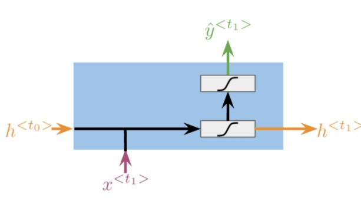
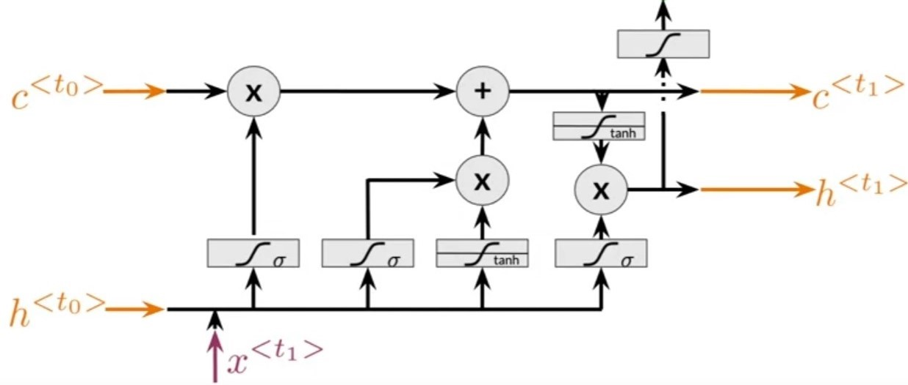
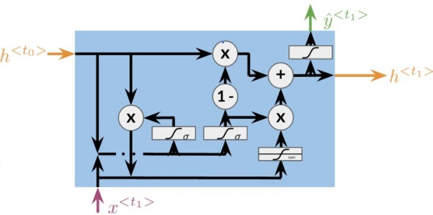
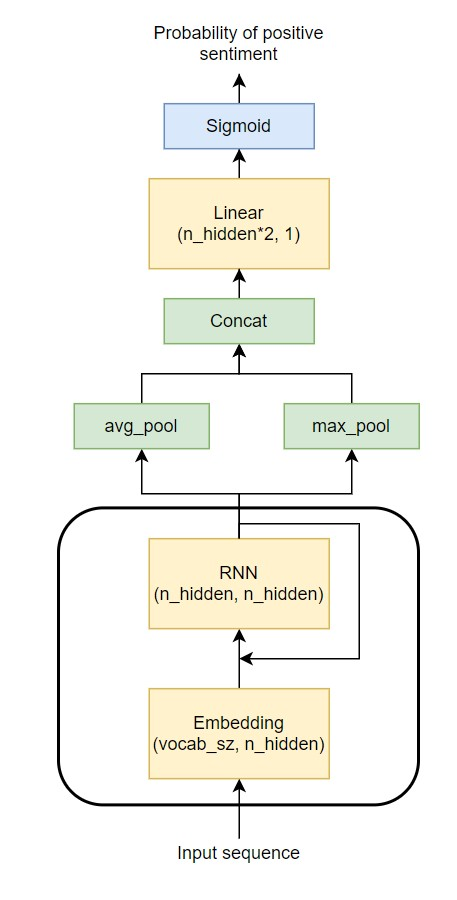
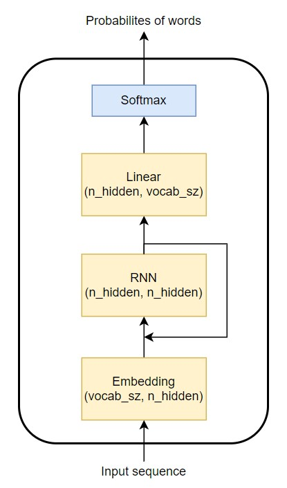

# Sequence Models
This repository implements a variety of <b>sequence model architectures from scratch in PyTorch</b>. Effort has been put to make the code well structured so that it can serve as learning material. The training loop implements the <b>learner design pattern</b> from fast.ai in pure PyTorch, with access to the loop provided through callbacks. Detailed logging and graphs are also provided with python logging and <a href='https://wandb.ai/site'>wandb</a>. Additional implementations will be added.


## Table of Contents
* [Setup](#setup)
* [Usage](#usage)
* [Implementations](#implementations)
    * [RNN](#rnn)
    * [LSTM](#lstm)
    * [GRU](#gru)
    * [Sentiment Classifier](#sentiment-classifier)
    * [Language Model](#language-model)
* [Citation](#citation)
* [License](#benchmarks)

## Setup 
Using Miniconda/Anaconda:
1. `cd path_to_repo`
2. `conda create --name <env_name> --file requirements.txt`
3. `conda activate <env_name>`

## Usage
Global configuration for training/inference is found in `src/config.py`. To **train** a model customize the configuration by selecting everything from the model (For the list of available models see `src/model_dispatcher.py`) to learning rate and run:   

```
python src/train.py
```
Training saves the model in `runs/` along with the preprocessor/tokenizer and logs. For loss and metric visualizations enable <a href='https://docs.wandb.ai/quickstart'>wandb experiment tracking.</a>


To **interact** with a model make sure the model was trained beforehand. By keeping the same configuration you can then run: 
```
python src/interact.py
```


# Implementations
## RNN
Implementation of the vanilla Recurrent Neural Network is available in `src/models/rnn.py`. This is the most basic RNN which is defined with the RNN Cell pictured below ( Credit for the visualization belongs to deeplearning.ai). This cell is being applied to every timestep of a sequence, producing an output and a hidden state that gets fed back to it in the next timestep. These cells are often represented in a chain (unrolled representation), but one must remember that every link of that chain represents the same RNN Cell, in other words, the weights are the same. This forces the RNN cell to learn to be able to handle any timestep/position in a sequence. Some of the key points in which RNNs differ compared to FFNNs are:
- Concept of time is resembled in the architecture
- Inputs can be of arbitrary lengths
- Network keeps memory of past samples/batches

 For more details see my <a href='https://bkoch4142.github.io/blog/jupyter/nlp/2020/10/22/RNN-Intuition-Theory-Implementation.html'>post</a> on the RNN.

<p align="center">
    
</p>

## LSTM
Implementation of the Long-Short Term Memory is available in `src/models/lstm.py`. LSTM was designed to handle common problems of RNN's which included vanishing gradients and memory limitations. This was accomplished with an additional hidden state called the *cell state* (long term memory) and so-called *gates* which guard it and act as memory management. Gradient problem was mitigated with this because, as seen in the visualization below (Credit for the visualization belongs to deeplearning.ai), the cell state doesn't pass through any linear layers. Cell state is influenced only through addition or element-wise multiplication with the output of gates. Gates and their short roles:
- Forget gate: what information to keep and what to forget in the long memory
- Input gate: what information needs to be updated in the long memory
- Cell gate: how the information will be updated in the long memory
- Output gate: what part of the long memory is relevant for the short memory

For more details view my <a href='https://bkoch4142.github.io/blog/nlp/2020/11/08/LSTM.html'>post</a> on the LSTM.

Original Paper: [Long Thort-Term Memory](https://www.bioinf.jku.at/publications/older/2604.pdf)

<p align="center">
    
</p>

## GRU 
Implementation of the Gated Recurrent Unit is available in `src/models/gru.py`. GRU loses the cell state compared to the LSTM and has a simpler structure.  Below is the architecture of a GRU cell. For a more detailed comparison, one might take a look at [Empirical Evaluation of Gated Recurrent Neural Networks on Sequence Modeling](https://arxiv.org/pdf/1412.3555v1.pdf). GRU cell architecture is presented below (Credit for the visualization belongs to deeplearning.ai). 

Original Paper:  [Learning Phrase Representations using RNN Encoder-Decoder for Statistical Machine Translation](https://arxiv.org/abs/1406.1078)

<p align="center">
    
</p>

## Sentiment Classifier

Implementation of a Sentiment Classifier is available in `src/models/sentiment_clf.py`. Dataset used for training is the IMDb dataset of positive and negative movie reviews available in `data/imdb.csv`.

Datapoint examples:
```
This movie is terrible but it has some good effects. , negative
...
```

Example `config.py`:
```
RUN_NAME='test'
BATCH_SIZE=128
WORKER_COUNT=4
EPOCHS=5
DATASET='imdb'
MODEL='rnnsentimentclf'
LOSS='BCEWithLogitsLoss'
LR=1e-3
OPTIMIZER='Adam'
```

 A sentiment classifier is a model that takes as input a sentence and outputs its sentiment. There are many ways in which a sentiment classifier can be built. In this simple implementation, an embedding layer is used first as a learnable way to encode tokens into vectors. After that, an RNN (custom one is used but it can easily be swapped with the PyTorch one) is applied which produces output vectors across timesteps. Average pooling and max pooling is then applied to those vectors (shown to perform better than taking only the last output vector). Concatenated output from 2 pooling stages is fed through a linear layer and sigmoid to decide on the probability of positive sentiment. 

<p align="center">
    
</p>


## Language Model
Implementation of a Language Model is available in `src/models/language_model.py`. Dataset used for training is the human numbers dataset introduced by fast.ai. It features a letter representation of the first 10,000 numbers written in English. It is a very simple benchmark for language models.

Datapoint examples:
```
one 
two 
three 
four 
five 
six 
seven 
...
```

Example `config.py`:
```
RUN_NAME='test'
BATCH_SIZE=128
WORKER_COUNT=4
EPOCHS=5
DATASET='human_numbers'
MODEL='rnnlanguagemodel'
LOSS='CrossEntropyLoss'
LR=1e-3
OPTIMIZER='Adam'
```

Language model's task is to predict the next word in a sequence. This simple implementation features an embedding layer followed by an RNN (custom one is used but it can easily be swapped with the PyTorch one). The output of the RNN goes through a linear layer which maps to a vector whose length is the same as the vocabulary size. The same vector then goes through softmax which normalizes the vector to resemble probabilities of each word in our vocabulary being the next word. 


<p align="center">
    
</p>


## Citation
Please use this bibtex if you want to cite this repository:
```
@misc{Koch2021seqmodels,
  author = {Koch, Brando},
  title = {seq-models},
  year = {2021},
  publisher = {GitHub},
  journal = {GitHub repository},
  howpublished = {\url{}},
}
```


## License
This repository is under an MIT License

[]()
